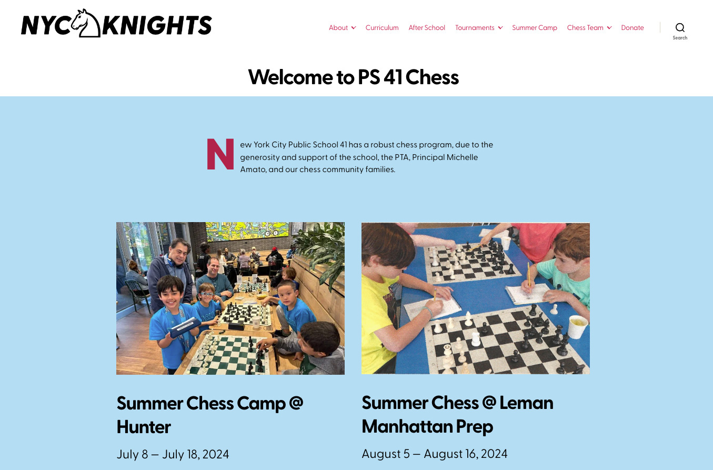

# Nick Golebiewski Fullstack Software Engineering Portfolio

Goal: Get this designed, coded and deployed in less than one day! (ACHIEVED)
Updates: They happen!

Deployed on Dreamhost Shared Server: https://tech.nickgolebiewski.com/

Tech used for this Single Page Application (including EVERYTHING!):

- React: Frontend Framework 
- JavaScript
- CSS (Mostly my own)
- Google Fonts: DM Sans, Major Mono, Kode Mono. I really went to town on this, but I think I pulled off 2 display fonts and one text font in one design!
- Vite: "Next Generation Frontend Tooling" a.k.a. build and dev tool.
- Visual Studio Code: Integrated Development Environment
- Terminal: Command Line Interface
- Ant Design: UI/UX Library --> Their anchor animation.
- Social Media logos, some from Bootstrap CSS, Patreon and Etsy from their logo asset pages.
- Gulp: Upload to Dreamhost Server. So Legacy! After you "npm run build" you can "npx gulp deploy" and voila.

Thanks!
-Nick

# Portfolio items

